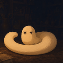
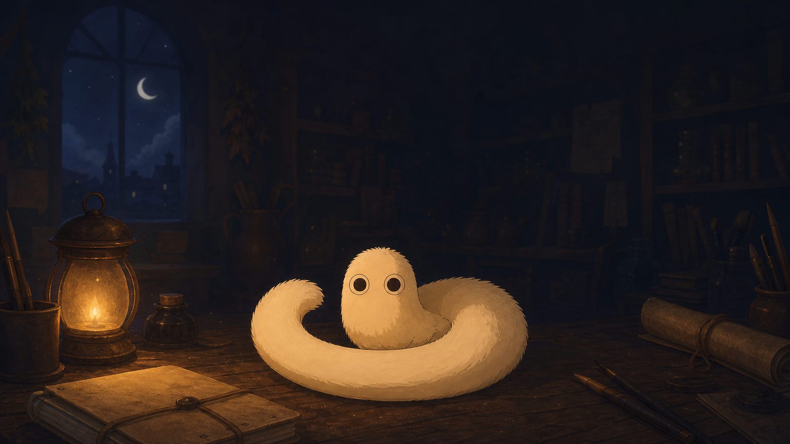
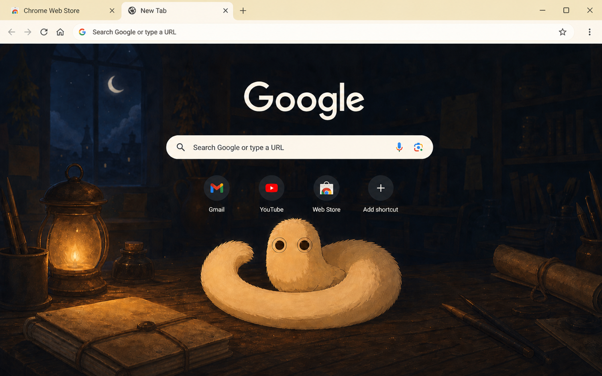
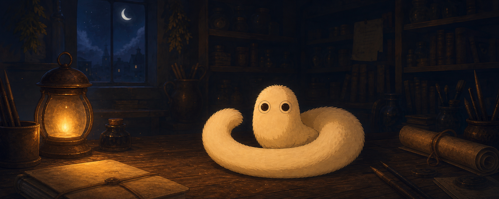

<p align="center">
  
</p>

<h1 align="center">Brushbug Cozy Night</h1>

<p align="center"><strong>A dark and cozy Chrome fan theme inspired by the brushbug from <em>Witch Hat Atelier</em></strong></p>

<p align="center">
  <a href="INSTALL.md">Install locally</a> ·
  <a href="https://chromewebstore.google.com/detail/brushbug-cozy-night/epiajojkoobbcdbhgppfpbjbheipfhbb">Chrome Web Store</a> ·
  <a href="../README.md">All Chrome themes</a>
</p>

---

## Preview



<p align="center"><sub>The exact 1920×1080 runtime background referenced by the theme manifest</sub></p>

## At a glance

| Detail | Value |
| --- | --- |
| Version | `1.0.2` |
| Package | Chrome theme · Manifest V3 |
| Background | `1920×1080` RGB PNG |
| Placement | Bottom center · no repeat |
| Palette | Champagne frames · ivory toolbar · warm charcoal controls |
| Access | No scripts, permissions, tracking, or data collection |

## Experience

- A candlelit atelier scene composed for Chrome's New Tab page
- Soft champagne tabs that echo the lantern glow
- A warm ivory toolbar and address bar with clear charcoal controls
- A `128×128` icon included in the package manifest

## Chrome Web Store assets



| Asset | Preview |
| --- | --- |
| Small promo tile · `440×280` |  |
| Marquee promo tile · `1400×560` |  |

See the [dashboard field sheet](listing/store-listing-en.md) for the category, language, listing copy, and upload map

## Installation

[Install locally](INSTALL.md)

Choose the published [Chrome Web Store release](https://chromewebstore.google.com/detail/brushbug-cozy-night/epiajojkoobbcdbhgppfpbjbheipfhbb) for normal updates. The local guide covers loading the theme from this repository or an extracted release ZIP

The Store listing version may lag behind the repository version until an update is reviewed and published

## Package map

| Path | Purpose |
| --- | --- |
| `manifest.json` | Theme metadata, colors, and runtime asset references |
| `images/` | Runtime background loaded by Chrome |
| `assets/source/` | Original generated artwork, marketplace source images, and generation notes |
| `store-assets/` | Chrome Web Store icon, screenshot, and promotional images |
| `listing/` | Chrome Web Store field sheet, summary, and detailed description |
| `INSTALL.md` | Local installation, removal, and troubleshooting |
| `CHANGELOG.md` | Theme-specific release history |

## Validate and package

Run commands from the repository root

```bash
python3 tools/chrome/validate_theme.py chrome/brushbug-cozy-night
```

```bash
python3 tools/chrome/build_theme.py \
  chrome/brushbug-cozy-night \
  --output dist/chrome/brushbug-cozy-night-v1.0.2.zip
```

> [!NOTE]
> The Chrome theme manifest provides alignment and repeat controls, but no background-sizing property such as CSS `cover` or `contain`. The visible area can vary with window size, display scale, and browser zoom

## Distribution and rights

This is an unofficial fan-made theme. It is not affiliated with, sponsored by, or endorsed by the original creators or rights holders. Related character names and intellectual property belong to their respective owners

Chrome Web Store publication and public repository availability are separate distribution surfaces. Neither represents copyright clearance, affiliation, or an open-source license for third-party character elements

Review the repository [rights and distribution notice](../../RIGHTS.md) before redistributing the artwork or applying a repository-wide license
